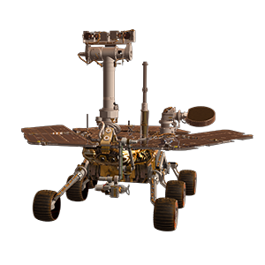

# 

# Pathfinders

## Table of Contents

1. Introduction
2. Installation
3. About the code
4. API
5. Team

---

## 1.

## Introduction

### This simple mobile app was made by 5 students of WildCodeSchool for their first hackathon. The job was to build a time-killer for Perseverance and Ingenuity on their Mars mission. Instead, we created something which will help them survive.

---

## 2.

## Installation

1. Clone the repo:
   ```sh
   git clone https://github.com/LucaMilanese90/hackathon
   ```
2. Install NPM packages:

   ```sh
   npm install
   ```

3. Run the app in the development mode with:

   ```sh
   npm start
   ```

4. Open [http://localhost:3000](http://localhost:3000) to view it in the browser.\
   The page will reload if you make edits.\
   You will also see any lint errors in the console.

### - (Disclaimer) - Please use it as a mobile version.

---

## 3.

## About the code

The main frameworks and technologies used to build our Project are the following:

- React (with _Hooks_ - _useState_, _useEffect_)
- React Router

---

## 4.

## API

- "NASA Image and Video Library"
  ⋅⋅⋅ [Documentation](https://images.nasa.gov/docs/images.nasa.gov_api_docs.pdf) in PDF

---

## 5.

## The Team:

Who is in Pathfinders team?

- Sofia,
- Luca,
- Marek,
- Grodon,
- Feras.
